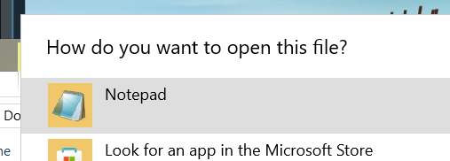
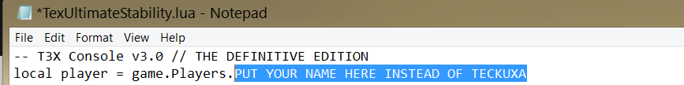
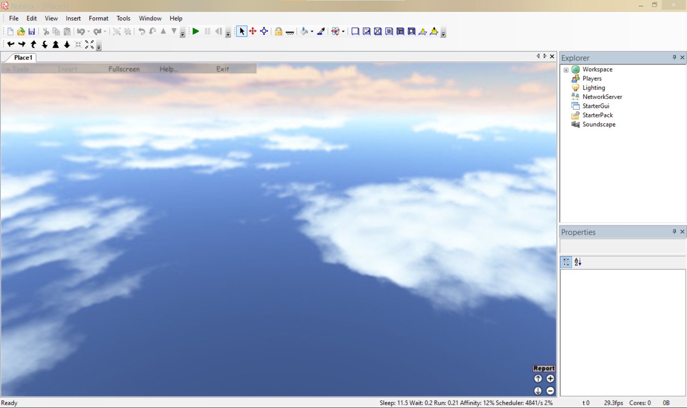
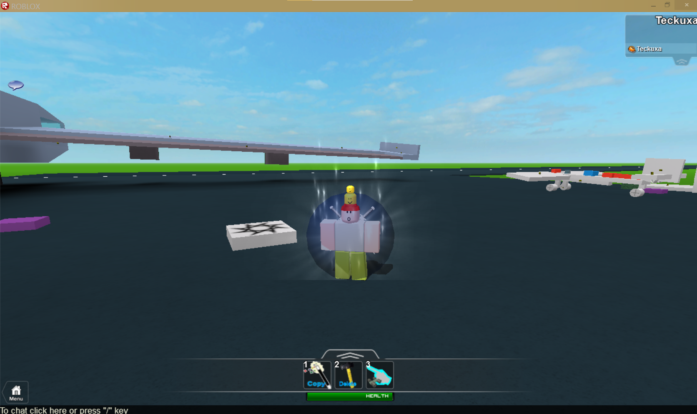
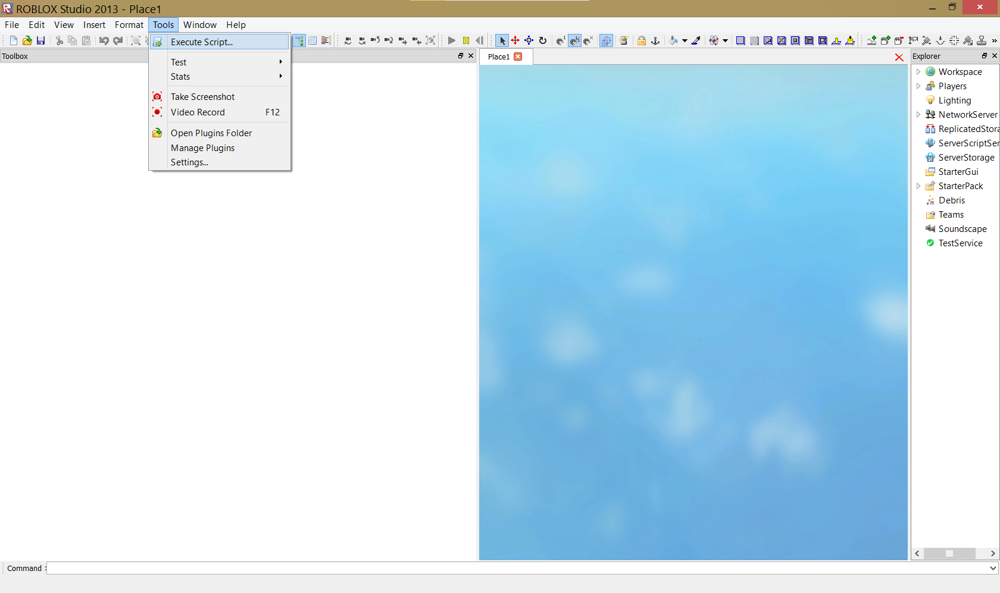
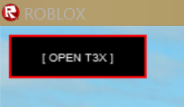
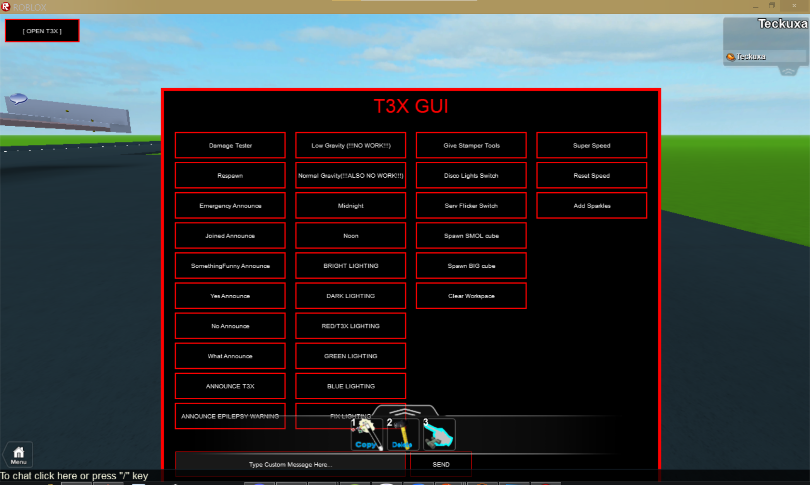

# Welcome to T3X!
## T3X is an admin panel for your old roblox clients form 2009L-2013L, tested in all clients mentioned before

# How to use T3X?
1) Launch LUA file that you doownloaded using notepad

2) Change "Teckuxa" to your name in LUA file that you installed

3) Launch your server in whatever client you use ( I use ORRH in this example)

4) Connect to your hosted server

5) Open studio and navigate to **menu panel ( bar at the top ) -> Tools -> Execute script** amd execute the script you edited

6) Click "OPEN T3X" in the top left of your joined client ( not studio )

7) Enjoy!

